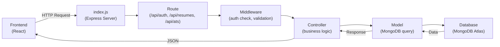
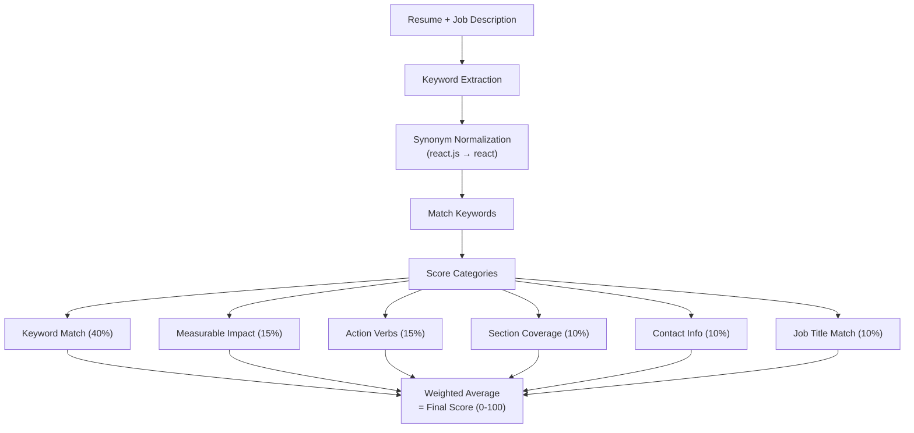

# Backend Samjho — Step by Step 🧠

Poora backend ka flow simple language mein. Har file kya karti hai, kyun hai, aur kaise kaam karti hai.

---

## Folder Structure

```
server/src/
├── index.js              ← Server start hota hai yahaan se (entry point)
├── seed.js               ← Demo data daalti hai DB mein
├── config/
│   └── db.js             ← MongoDB se connection
├── models/
│   ├── User.js           ← User ka schema (name, email, password)
│   └── Resume.js         ← Resume ka schema (sections, template, score)
├── middleware/
│   ├── auth.js           ← Login check (JWT verify)
│   ├── error.js          ← Error handling
│   └── validate.js       ← Input validation (Zod)
├── controllers/
│   ├── authController.js ← Register, Login, Me
│   ├── resumeController.js ← Resume CRUD (Create, Read, Update, Delete)
│   └── atsController.js  ← ATS score analyze karta hai
├── routes/
│   ├── auth.js           ← /api/auth/* routes
│   ├── resume.js         ← /api/resumes/* routes
│   └── ats.js            ← /api/ats/* routes
├── services/
│   └── atsAnalyzer.js    ← Scoring engine (keyword match, action verbs, etc.)
└── utils/
    ├── schemas.js        ← Zod validation schemas
    └── token.js          ← JWT sign/verify helpers
```

---

## Request ka Flow (Kaise kaam karta hai)

Jab bhi frontend se koi API call aati hai, ye hota hai:



**Example**: User login karta hai
1. Frontend `POST /api/auth/login` bhejta hai `{ email, password }`
2. `index.js` → route match → `routes/auth.js`
3. `validate(loginSchema)` → check karta hai email valid hai ya nahi
4. `authController.login()` → DB mein user dhundhta hai, password compare karta hai
5. Match hua → JWT token bana ke bhejta hai ← frontend isko save karta hai

---

## File-by-File Explanation

---

### 1. `index.js` — Server ka entry point

```
Ye sab kaam karta hai:
1. .env file load karta hai (DB URL, JWT secret, etc.)
2. Express app banata hai
3. Security middleware lagata hai (helmet, cors, rate-limit)
4. Routes register karta hai
5. MongoDB se connect karta hai
6. Server start karta hai port 5001 pe
```

#### Key lines samjho:

| Line | Kya karta hai |
|---|---|
| `app.use(helmet())` | Security headers add karta hai (XSS protection, etc.) |
| `app.use(cors({...}))` | Frontend ko allow karta hai API call karne ke liye |
| `app.use(express.json())` | Request body ko JSON mein parse karta hai |
| `authLimiter` | 15 min mein max 50 login attempts — brute force se bachata hai |
| `app.get("/api/health")` | Server alive hai ya nahi check karne ka simple endpoint |
| `connectDB().then(...)` | Pehle DB connect, phir server start |

---

### 2. `config/db.js` — MongoDB Connection

Bahut simple file — bas 11 lines:

```js
export async function connectDB(uri) {
  if (!uri) throw new Error("MONGO_URI is not set...");
  mongoose.set("strictQuery", true);
  await mongoose.connect(uri, { autoIndex: true });
  console.log("✓ MongoDB connected");
}
```

- `strictQuery: true` → agar tum koi field query karo jo schema mein nahi hai, toh ignore karega (safe)
- `autoIndex: true` → schema mein jo `index: true` hai (jaise email), MongoDB automatically index bana lega

---

### 3. `models/User.js` — User Schema

```
User = {
  name:     "Mohd Zaid"
  email:    "zaidm1323@gmail.com"    ← unique, lowercase
  password: "$2a$10$xyz..."          ← hashed (bcrypt)
  role:     "admin" ya "user"
}
```

#### Important patterns:

**Password kabhi direct save nahi hota:**
```js
userSchema.pre("save", async function(next) {
  if (!this.isModified("password")) return next(); // sirf jab password change ho
  const salt = await bcrypt.genSalt(10);
  this.password = await bcrypt.hash(this.password, salt);
  next();
});
```
Ye `pre-save hook` hai — jab bhi `User.create()` ya `user.save()` call hota hai, ye automatically password ko hash kar deta hai.

**Password query mein nahi aata:**
```js
password: { type: String, select: false }
```
`select: false` ka matlab — jab bhi `User.find()` ya `User.findById()` karo, password field nahi aayega. Login ke time explicitly `.select("+password")` likhna padta hai.

**`toSafeJSON()`** — frontend ko bhejne se pehle password hata ke safe data deta hai.

---

### 4. `models/Resume.js` — Resume Schema

Resume mein sub-schemas hain:

```
Resume = {
  user:           ← kis user ka hai (ObjectId reference)
  title:          "Software Engineer Resume"
  template:       "modern"
  accent:         "#2563eb"
  personal: {
    fullName, jobTitle, email, phone, location,
    website, linkedin, github, summary
  }
  experience:     [{ company, role, location, startDate, endDate, bullets[] }]
  education:      [{ school, degree, field, startDate, endDate, grade }]
  projects:       [{ name, description, link, tech[] }]
  certifications: [{ name, issuer, date }]
  skills:         ["React", "Node.js", ...]
  languages:      ["English", "Hindi"]
  lastScore:      85
}
```

> [!NOTE]
> Sub-schemas mein `{ _id: false }` hai — iska matlab har experience/education item ko apna alag `_id` nahi milega. Ye unnecessary hai embedded arrays ke liye.

---

### 5. `middleware/auth.js` — JWT Authentication Check

```js
export async function requireAuth(req, res, next) {
  // 1. Token dhundho — header mein ya cookie mein
  const token = header.startsWith("Bearer ") ? header.slice(7) : req.cookies?.token;
  
  // 2. Token nahi mila → 401
  if (!token) return res.status(401).json({ message: "Not authenticated" });
  
  // 3. Token verify karo (JWT secret se)
  const decoded = verifyToken(token);
  
  // 4. User DB mein hai ya nahi check karo
  const user = await User.findById(decoded.sub);
  if (!user) return res.status(401).json({ message: "User no longer exists" });
  
  // 5. Sab sahi hai → req.user mein daal do, aage jaao
  req.user = user;
  next();
}
```

Ye middleware har protected route pe lagta hai. Agar token invalid hai → 401 error. Agar valid hai → `req.user` set ho jaata hai aur controller use kar sakta hai.

---

### 6. `middleware/validate.js` — Zod Validation

```js
export const validate = (schema) => (req, res, next) => {
  const result = schema.safeParse(req.body);
  if (!result.success) {
    // Zod errors ko clean format mein bhejo
    return res.status(422).json({ message: "Validation failed", errors });
  }
  req.body = result.data;  // parsed/clean data se replace karo
  next();
};
```

**Ye kyun hai?** Frontend se koi bhi data aa sakta hai. Validation ensure karta hai:
- Email valid hai
- Password 6+ characters hai
- Required fields missing nahi hain

Agar validation fail → **422** error with field-level messages.

---

### 7. `middleware/error.js` — Error Handling

3 cheezein hain:

| Function | Kya karta hai |
|---|---|
| `notFound` | Koi route match nahi hua → `404 Route not found` |
| `errorHandler` | Koi bhi error aaye → clean JSON response bhejta hai |
| `asyncHandler` | Async controller mein `try-catch` likhne ki zaroorat nahi — ye automatically error pakad leta hai |

```js
// Bina asyncHandler:
export const login = async (req, res, next) => {
  try {
    // ... logic
  } catch (err) {
    next(err);  // har jagah ye likhna padta
  }
};

// asyncHandler ke saath:
export const login = asyncHandler(async (req, res) => {
  // ... logic — error automatically handle ho jaayega
});
```

---

### 8. `controllers/authController.js` — Auth Logic

3 functions hain:

#### `register` — Naya account banao
```
1. Email already exist karta hai? → 409 "already exists"
2. User.create() → password auto-hash hoga (pre-save hook)
3. JWT token banao → bhejo { token, user }
```

#### `login` — Login karo
```
1. Email se user dhundho (.select("+password") — password bhi laao)
2. user.comparePassword() — bcrypt compare
3. Match nahi → 401 "Invalid email or password"
4. Match hua → JWT token banao → bhejo { token, user }
```

#### `me` — Current user kaun hai
```
1. requireAuth middleware ne already req.user set kar diya
2. Bas req.user.toSafeJSON() bhej do
```

---

### 9. `controllers/resumeController.js` — Resume CRUD

| Function | Route | Kya karta hai |
|---|---|---|
| `listResumes` | `GET /api/resumes` | User ke saare resumes list karo (sirf title, template, score) |
| `getResume` | `GET /api/resumes/:id` | Ek resume ka poora data |
| `createResume` | `POST /api/resumes` | Naya resume banao |
| `updateResume` | `PUT /api/resumes/:id` | Resume update karo (auto-save bhi isi se hota hai) |
| `duplicateResume` | `POST /api/resumes/:id/duplicate` | Resume copy karo — title mein "(copy)" lag jaata hai |
| `deleteResume` | `DELETE /api/resumes/:id` | Resume delete karo |

> [!IMPORTANT]
> **Security**: Har query mein `user: req.user._id` hai — matlab ek user doosre ke resumes kabhi access nahi kar sakta. Ye bahut important hai.

---

### 10. `controllers/atsController.js` — ATS Analysis

```
1. Frontend bhejta hai: { resumeId, jobDescription }
2. DB se resume uthao
3. analyzeResume(resume, jobDescription) — scoring engine call karo
4. Score save karo DB mein (lastScore update)
5. Result bhej do { score, breakdown, keywords, suggestions }
```

---

### 11. `services/atsAnalyzer.js` — Scoring Engine (sabse complex file)

Ye **koi AI nahi hai** — pure rules aur heuristics se kaam karta hai:



#### Kaise score karta hai:

| Category | Weight | Kya check karta hai |
|---|---|---|
| **Keyword Match** | 40% | Job description ke keywords resume mein hain ya nahi |
| **Measurable Impact** | 15% | Bullets mein numbers hain ya nahi (%, $, 2x, etc.) |
| **Action Verbs** | 15% | Bullets "Built", "Led", "Improved" se start hote hain ya nahi |
| **Job Title Match** | 10% | Resume ka title job description se match karta hai ya nahi |
| **Section Coverage** | 10% | Summary, experience, education, skills — sab filled hain ya nahi |
| **Contact Info** | 10% | Email, phone, LinkedIn, website — kitne hain |

#### Special features:
- **Synonym Map**: `react.js`, `reactjs`, `React` sab ko `react` maan leta hai
- **Stopword Filter**: "the", "and", "is", "are" jaise common words ignore karta hai
- **Multi-word Phrases**: "machine learning", "ci/cd", "rest api" ko ek keyword maanta hai
- **Weak Bullet Detection**: Jo bullets action verb se start nahi hote, unko flag karta hai

---

### 12. `routes/` — Route Files

Routes files sirf **wiring** karti hain — kaunsa URL kaunse middleware aur controller se connect ho:

```
POST /api/auth/register  →  validate(registerSchema)  →  authController.register
POST /api/auth/login     →  validate(loginSchema)     →  authController.login
GET  /api/auth/me        →  requireAuth               →  authController.me

GET    /api/resumes      →  requireAuth  →  resumeController.listResumes
POST   /api/resumes      →  requireAuth  →  validate  →  resumeController.createResume
GET    /api/resumes/:id  →  requireAuth  →  resumeController.getResume
PUT    /api/resumes/:id  →  requireAuth  →  validate  →  resumeController.updateResume
DELETE /api/resumes/:id  →  requireAuth  →  resumeController.deleteResume

POST /api/ats/analyze    →  requireAuth  →  validate  →  atsController.analyze
```

---

### 13. `utils/schemas.js` — Validation Rules

Zod schemas define karti hain ki frontend se kya data accept karna hai:

```
registerSchema: { name (2-80 chars), email (valid), password (6-128 chars) }
loginSchema:    { email (valid), password (required) }
resumeSchema:   { title, template, accent, personal, experience, skills, ... }
analyzeSchema:  { resumeId?, resume?, jobDescription (required) }
```

---

## Ek Aur Baar — Poora Flow Summary

```
User clicks "Login" on frontend
        ↓
POST /api/auth/login { email, password }
        ↓
index.js → authLimiter (rate limit check) → routes/auth.js
        ↓
validate(loginSchema) — email valid hai? password blank toh nahi?
        ↓
authController.login() — DB mein user dhundho, password compare karo
        ↓
Match hua → JWT sign karo → { token, user } bhejo
        ↓
Frontend token localStorage mein save karta hai
        ↓
Ab har API call mein header mein bhejta hai: "Authorization: Bearer <token>"
        ↓
requireAuth middleware token verify karta hai → req.user set karta hai
        ↓
Controller safely user ka data access karta hai
```
